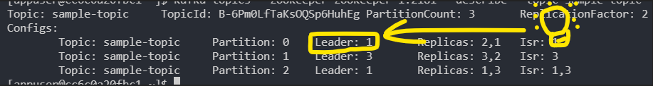

# CS3219 Task D: Pub-sub messaging 

## **Student Information**

Name: Kor Ming Soon
Matriculation Number: A0201975A
Github Repo: https://github.com/kormingsoon/cs3219-taskd

---

This repository is for my submission for Task D for the OTOT assignment in CS3219. This is an introductory repository to setting up Kafka with Docker to carry out simple pub-sub messaging, with ZooKeeper managing Kafka nodes.

In this repository, we are setting 3 nodes in the Kafka server as well as 3 Zookeepers for the management of the Kafka nodes. This section is split into two: deploying of the kafka with docker with pub-sub messaging, and also election of a new master node from forced failure.

#### How to deploy Kafka with Docker for pub-sub messaging:

1. Ensure that you have Docker installed in your computer.  
   
2. Run the following command to spin up the Docker images running the Kafka and Zookeeper. The ```-d``` will ensure that the progress runs in the background. 
   
        docker-compose up -d 

3. After doing so, check that the images are up and running. If done right, the following should show. Refer to the following two images showing the visual confirmation of the images running. Run the following command to check the images, or use Docker Desktop:

    
        docker ps
    <div style="text-align:center">
       
      <p align="center"> CLI Confirmation</p>
    </div>
    <br>
    <div style="text-align:center">
        
        <p align="center"> GUI (Docker-Desktop) Confirmation </p>
    </div>

4. Run the following command to access the Kafka node to begin communication. Notice after the command, the bash changes.

        docker exec -it cs3219-taskd_kafka-1_1 bash

    <div style="text-align:center">
        
    </div>

5. We will begin by creating the ```topic```, after which we will mock the ```producer``` and ```consumer``` of the messages transmitted between the two parties. For the topic, we will create it to be only have replication factor of 1, and belonging only in 1 partition.

        kafka-topics --create --zookeeper zookeeper-1:2181 --replication-factor 2 --partitions 3  --topic sample-topic
    
    
    5.1 In the event the following shows up, restart the Zookeeper servers and Nodes and repeat the topic creation command. 

        ERROR org.apache.kafka.common.errors.InvalidReplicationFactorException: Replication factor: 1 larger than available brokers: 0.(kafka.admin.TopicCommand$)
    
    A successful command will yield the following:

        Created topic sample-topic.

6. Run the following command to enter the producer console to publish events into the topic.

        kafka-console-producer --broker-list kafka-1:9092 --topic sample-topic

7. Launch another terminal window. Likewise, execute the bash command but now enter the consumer console to view the events of the topic.

        docker exec -it cs3219-taskd_kafka-1_1 bash

        kafka-console-consumer --bootstrap-server kafka-1:9092 --topic sample-topic --from-beginning

8. On the producer console, try typing some messages. You should see the message sent to the consumer console. Look at the example below.

    

With this, we have demonstrated the pub-sub capability of Kafka.

#### Election of new master node:

1. In this section, we will kill a node to demonstrate the capabilities of Zookeeper in electing a new leader node.

2. Before killing the node, we will observe the partition and the leader of the topics we have created. Run the following command to check the details of the topic:
        
        kafka-topics --zookeeper zookeeper-1:2181 --describe --topic sample-topic


3. In the following picture, you will see the details of the topic.
   
    <div style="text-align:center">
        
    </div>

4. Here, we can kill a node that happens to a leader of the partition, in our example we will kill node ``2`` which is a leader of the partition. We can use docker-desktop or the following command:

        docker container kill cs3219-taskd_kafka-2_1
    
    


5. Now, we will observe the topic again with the same command:

        kafka-topics --zookeeper zookeeper-1:2181 --describe --topic sample-topic

    

6. Again, to demonstrate pub-sub functionality is still running, we will launch another console and enter the kafka node, we will repeat as above with the following command: <br>
    First console:
        
        kafka-console-consumer --bootstrap-server kafka-3:9092 --topic sample-topic --from-beginning
    Second console:

        kafka-console-producer --broker-list kafka-3:9092 --topic sample-topic


You will observe that the Zookeeper has elected a new node to takeover and ensure the events are still communicated between a producer and consumer on the same topic.